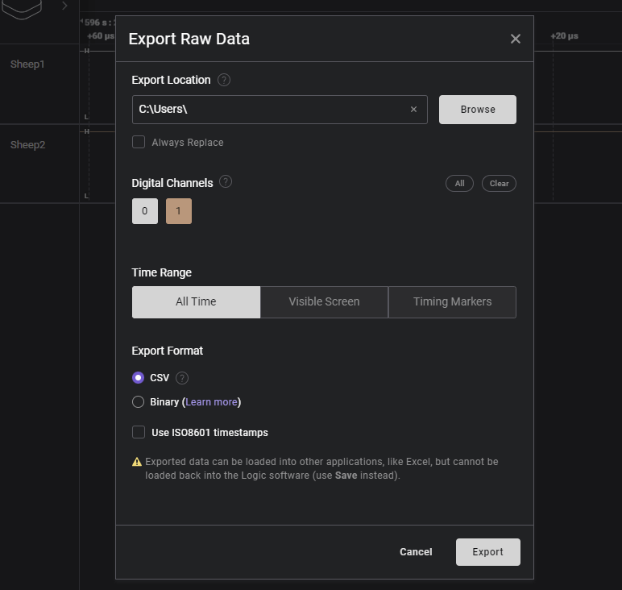

# Time-Sync - Measurement

## Prepare Software

### Prepare Host

The Host PC will

- control the devices via the ssh-sessions
- record the sync-performance with a logic analyzer connected to each sheep ([Saleae Software](https://www.saleae.com/downloads/))
- stress-test sheep and network with workloads (iperf3 is needed, available via apt)

### Prepare nodes

This involves

- choosing and installing linux-image
- configure PTP & phc2sys
- cleaning up the system to reduce interrupts
- activating the kernel-module to trigger the gpio

Tests require 2 to 3 embedded systems running linux

- advantage of 3: one node can be ptp-server, the others are clients
- the server can have a sync-offset on hardware-level

Devices are connected to a dhcp network (network under test)

#### BeagleBone Black

Follow the [shepherd installation guide](../../user/getting_started)
Timing-Output is generated by PRU by default and needs modification of KernelModule-Code.

#### BeagleBone AI64

Steps are described in [AI64-Eval-Document](https://orgua.github.io/shepherd-v2-planning/40_embedded_sys/evaluate_beaglebone_AI64.html)

#### Raspberry CM4

Steps are described in [CM4-Eval-Document](https://orgua.github.io/shepherd-v2-planning/40_embedded_sys/evaluate_raspberry_CM4.html)

#### Kernel-Module Modification

There are two specialized branches to GPIO-Access on Kernel-Level

- [Kernel510](https://github.com/nes-lab/shepherd/tree/Kernel510/software/kernel-module/src): allows direct gpio-access for BBone Black & AI64
- [Kernel61RPi](https://github.com/nes-lab/shepherd/tree/Kernel61RPi/software/kernel-module/src): same for Raspberry PI CM4

⇾ compile and install these

## Set up Hardware

After having the software ready there are three steps for getting the hardware ready for the measurements:

- get all nodes on the same network
  - Try to model the future network
- route power to each system
  - special reqs. are noted below
  - POE-Adapters are always a good idea
- get the logic analyzer connected to the gpio-trigger-output
  - connecting the ptp server to pin 0 of the analyzer is recommended, as it might show a difference in behavior
  - don't forget to also connect ground

### Quick-HowTo for the Saleae logic analyzer

- channel-numbers are printed on the bottom-side
- the removable connector-leads are color-coded and also have the channel-number printed on the individual ends
- all ground-cables are black & without a channel-number printing

### Raspberry Pi CM4

- power via barrel connector can be 7 - 27 V and defaults to 12 V
- current draw is typically < 150 mA @ 12 V, can increase under load, but is < 500 mA
- signal-pin is the uppermost right on the main connector
- ground reference is right below signal


### BBone AI64

- power via USB Type C is fine
- be sure to give the heatsink some air - the system can crash from heat
- signal-pin is the second from left on the lower row on P8
- ground reference is left from signal, in the lower left corner


### BBone Black

Small introduction into beaglebone

- orientation: ICs / CPU visible, ETH-Connector facing left so the white font (silkscreen) on PCB is readable
- there are two large connectors P8 on top, P9 on bottom. each has 46 pins, with pin 1 in the lower left corner - compare with silkscreen
- P8 is our main-connector for the test. Pin 1 & 2 (left-most) are ground / GND
- NOTE: there are (small) white markers on the PCB that indicate start of a decade

Connect logic analyzer to each sheep

- GND goes to P8-01 or P8-02
- Channel wire goes to P8-19 for the kernel-output
- for debug another channel can be hooked up to P8-28 (pru-output)


## Measurement

### Preparation

- set up hardware and software according to steps described above
- check that ptp is working
  - option 1: via logic analyzer (see subchapter below)
  - option 2: via ssh-connection (commands below)
- PTP should be given >= 5 minutes to stabilize
- room-temperature should be stable, as clock-crystals react to that

**Note for RPi CM4**

Changing the governor to `performance` does not always work during boot, please check. At least the ptp-server is mostly stuck on `ondemand`.

```Shell
# check
cpufreq-info
# reset
sudo cpufreq-set --governor performance
```

#### Quick-HowTo for Sync-Services

Current state of PTP can be checked on the nodes with

```Shell
sudo journalctl -u ptp4l@eth0.service -b -f
sudo journalctl -u phc2sys@eth0.service -b -f
```

Fixing time-sync problems can be solved be restarting the services and shepherd-kernel-module

```shell
# note: if ptp is restarted, phc must also be restarted
sudo systemctl restart ptp4l@eth0
sudo systemctl restart phc2sys@eth0
```

:::{note}
Screenshots of correctly running [ptp](ptp_running_fine.png) and [phc2sys](phc2sys_running_fine.png) services are show behind the link. Both tools can misbehave when other ptp-hosts are present. Frequency adjustment value usually jumps to max in that case (+-100 us).
:::

#### Quick-HowTo for Logic 2 Software

- config under `Device Settings` (device-shaped symbol in top left corner of plot)
  - select connected channels -> usually `0 to 2` (Digital, NOT Analog)
  - select highest samplerate -> `500 MS/s`
  - select highest voltage-levels -> `3.3+ Volts`
  - set `Timer` to record for `100 s` (and stop automatically after that)


- a failed sync looks like that:


- a successful sync shows minimal delay between the rising edges of each node, seen here with 92 ns as largest distance


**Don't forget** to save the capture after each measurement with a meaningful name, i.e. `01_baseline.sal`!

#### Quick-HowTo for IPerf3

IPerf3 can be used to generate network traffic.

```Shell
sudo apt install iperf3

# mockup server: device receiving data
iperf3 -s

# ptp-clients send, here 100Mbit to server-IP for 10 s
iperf3 -b 100M -c 10.0.0.200
```

The server can only receive data from one client at the same time. Therefore the two ptp-clients should be used in alternating pattern. It's best to start the recording first, then begin with traffic and alternate for ~ 50 - 70 s. The recording should show ~ 20 s of ptp getting back to normal at the end.

### Collecting the Data with Logic 2 Software

It's recommended to separate different campaigns and hardware-setups by subdirectories. A small textual description can help for later analysis. Notes of oddities and reported ptp path delays add valuable context.

#### The following measurements are recommended

- 01 - baseline (stable, undisturbed network)
- 02 - ptp-clients send data to external host with 100 Mbit/s
- 03 - ptp-clients send data with 200 Mbit/s
- 04 - ptp-clients send data with 400 Mbit/s
- 05 - ptp-clients send data with 800 Mbit/s
- 06 - ptp-clients receive data from external host with 100 Mbit/s
- 07 - ptp-clients receive data with 200 Mbit/s
- 08 - two external hosts send at max rate

Each running for 100 s.

## Analysis

### Prepare Data

- Logic 2 Software -> File -> Export Data
- select channels: 1-3
- Time Range: All Time
- Format: CSV
- DON'T use ISO8601 timestamps
- Export and rename file to meaningful description



### Processing Data

See the dedicated [tool-page](../../external/readme_sync_analyzer.md) or an [exemplary analysis](../time_sync_analysis/readme.md)
