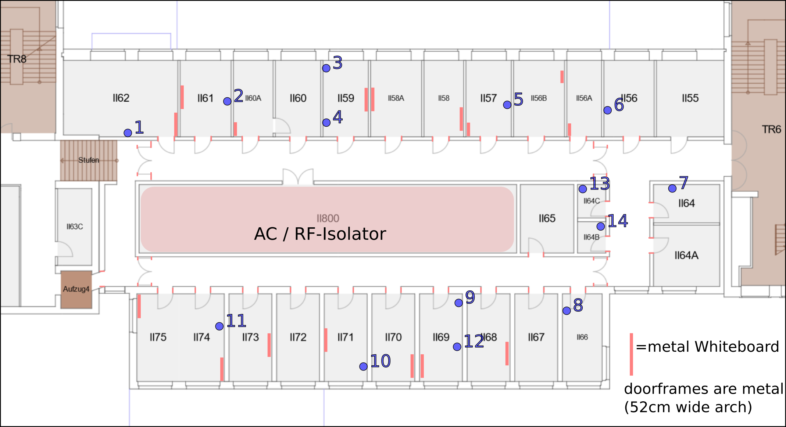

# Instance at TU Dresden

In the second half of 2023 a public instance of the Shepherd Testbed will go live. This section of the documentation will be landing-page and inform users about the first steps.

## Planned Deployment



The initial deployment will be covering the ring of offices around the buildings ventilation system. The inner structure mostly blocks RF due to lots of metal vents. 10 - 12 shepherd observers will be used for the testrun.

## Current Status

There are some residual roadblocks, but first initial internal tests are scheduled for mid september. The status is documented in a [GitHub Issue](https://github.com/orgua/shepherd/issues/21).

:::{attention}
Documentation is a mix of (some) old and (much) new. If you find oddities or have questions don't hesitate to contact us.
:::

## Controlling the Testbed

Currently direct shell-access to the server is needed. From there [Shepherd-Herd](https://pypi.org/project/shepherd_herd) can be used to execute Tasks created by the [Core-Datalib](https://pypi.org/project/shepherd_core).

It is planned to open an API-port to the internet. That would allow the testbed-client in the datalib to control the server remotely. In the near future each user-account can define experimental setups and the client transforms these to tasks, from patching the node-id into the firmware, over programming the targets, running the measurements and collecting the data for download.

Each Observer generates an hdf5-file. While we used shepherd in the past some postprocessing was generalized and bundled in the [main-datalib](https://pypi.org/project/shepherd_data). It is possible to extract logs, calculate metadata and generate plots.

### Example-workflow

First create define an experiment and transform it to a Task-set for the Testbed:

```Python
from shepherd_core.data_models import GpioTracing
from shepherd_core.data_models.content import EnergyEnvironment
from shepherd_core.data_models.content import Firmware
from shepherd_core.data_models.content import VirtualSourceConfig
from shepherd_core.data_models.experiment import Experiment
from shepherd_core.data_models.experiment import TargetConfig
from shepherd_core.data_models.task import TestbedTasks

xp1 = Experiment(
    name="rf_survey",
    comment="generate link-matrix",
    duration=4 * 60,
    target_configs=[
        TargetConfig(
            target_IDs=list(range(3000, 3010)),
            custom_IDs=list(range(0, 99)),  # note: longer list is OK
            energy_env=EnergyEnvironment(name="eenv_static_3300mV_50mA_3600s"),
            virtual_source=VirtualSourceConfig(name="direct"),
            firmware1=Firmware(name="nrf52_rf_survey"),
            firmware2=Firmware(name="msp430_deep_sleep"),
            power_tracing=None,
            gpio_tracing=GpioTracing(),
        )
    ],
)
TestbedTasks.from_xp(xp1).to_file("./tb_tasks_rf_survey.yaml")
```

Secondly transfer it to the testbed-server and run it:

```Shell
shepherd-herd run tb_tasks_rf_survey.yaml
```


## Related & Useful Links

- used [Hardware](#hardware) (Shepherd Cape, available Targets)
- available [firmwares for the targets](https://github.com/orgua/shepherd-targets)
    - adapted [Trafficbench](https://github.com/orgua/TrafficBench) for an [RF-survey](https://github.com/orgua/shepherd-targets/tree/main/nrf52_rf_survey)
    - the [Trafficbench pythontool](https://pypi.org/project/trafficbench)
- initial [RF-measurements](https://github.com/orgua/shepherd_v2_planning/blob/main/10_rf_measurements.ods) on the cfaed-floor

## Contributions

Feedback is more than welcome during that initial phase. Same for reusable & useful scripts or firmware you developed and want to donate.
