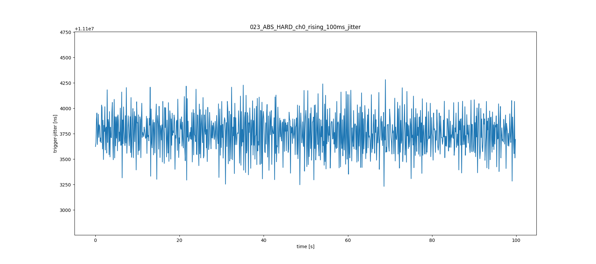
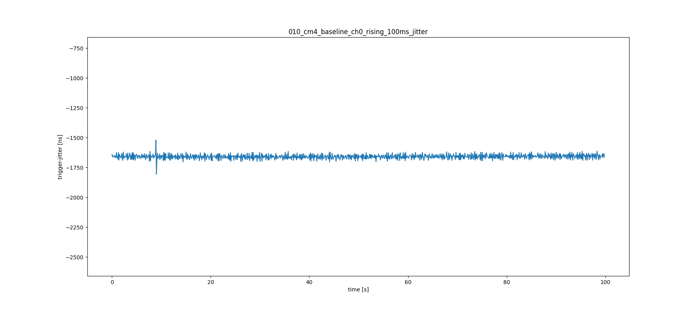
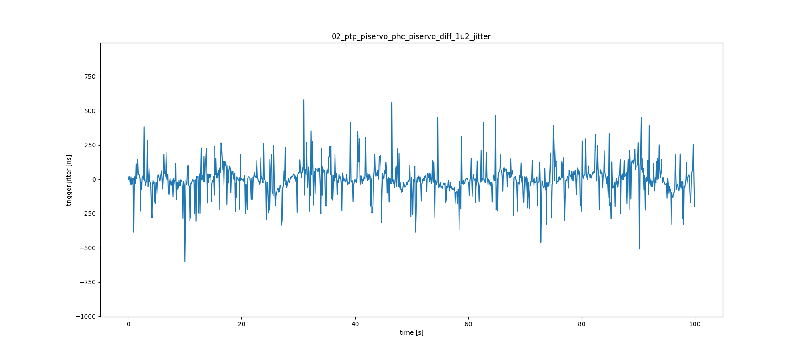

# Analysis

## Prepare Data

- Logic 2 Software -> File -> Export Data
- select channels: 1-3
- Time Range: All Time
- Format: CSV
- DON'T use ISO8601 timestamps
- Export and rename file to meaningful description

## Exemplary Analysis

Comparison between three embedded platforms and their performance

### Setup

- same cisco switch
- same software configuration (where possible)
- data recorded with a Logic Pro 16 @ 500 MHz
- nodes & network are at rest (baseline)

### GPIO - Jitter

How accurate is the 100 ms trigger on different platforms? Let's visualize the jitter of one node.

In numbers:
- simplified
- `Δ_q1 = 99%-Quantile - 1%-Quantile`
- `Δ_max = Max - Min`

| name                              | Δ_q1 [ns] | Δ_max [ns] |
|-----------------------------------|-----------|------------|
| BBB_023_ABS_HARD_ch0_rising_100ms | 874       | 1050       |
| BBAI_02_ptp_piservo_[..]ing_100ms | 464       | 16552      |
| 010_cm4_baseline_ch0_rising_100ms | 78        | 286        |

**BBone Black**

**BBone AI64**

**Raspberry Pi CM4**

#### Some context and final words:

- BBB takes ~ 300 ns to get kernel time. performance looks fine considering the age of the platform
- BBAI takes ~ 40 ns to get kernel time. the random spikes are still unexplained. It could be caused by register-write-locks. The SOC has several coprocessors that share the same bus (linux shows 2ß rProc). Also the system is missing a RT-Kernel.
- CM4 was overclocked to match BB-Ai, so it also takes ~ 40 ns to get kernel time. jitter looks best of these three systems

### Sync Performance

In numbers:
- `Δ_q1 = 99%-Quantile - 1%-Quantile`
- `Δ_max = Max - Min`

| name                         | Δ_q1 [ns] | Δ_max [ns] |
|------------------------------|-----------|------------|
| BBAI_02_ptp_piservo_[..]_1u2 | 669       | 1182       |
| RPI_005_norm_80_70_diff_1u2  | 336       | 378        |

**BBone AI64**

**Raspberry Pi CM4**

### Deeper Dive

Raw data and Plots are at [shepherd-planning](https://github.com/orgua/shepherd_v2_planning/tree/main/timesync'24)
