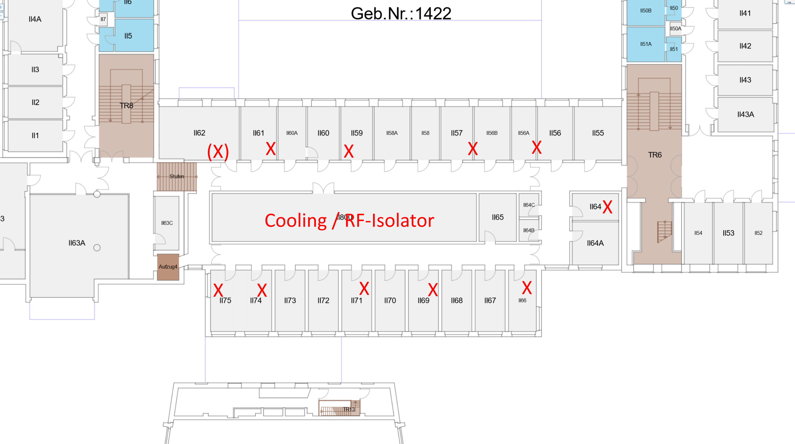

TB-Instance at TU Dresden
===========================

In the second half of 2023 a public instance of the Shepherd Testbed will go live. This section of the documentation will be landing-page and inform users about the first steps.

Planned Deployment
-------------------

The initial deployment will be covering the ring of offices around the buildings ventilation system. The inner structure mostly blocks RF due to lots of metal vents. 10 - 12 shepherd observers will be used for the testrun.

Current Status
--------------

There are some residual roadblocks, but first initial internal tests are scheduled for mid september. The status is documented in a `GitHub Issue <https://github.com/orgua/shepherd/issues/21>`_.

Controlling the Testbed
-----------------------

Currently direct shell-access to the server is needed. From there `Shepherd-Herd <https://pypi.org/project/shepherd_herd>`_ can be used to execute Tasks created by the `Core-Datalib <https://pypi.org/project/shepherd_core>`_.

It is planned to open an API-port to the internet. That would allow the testbed-client in the datalib to control the server remotely. In the near future each user-account can define experimental setups and the client transforms these to tasks, from patching the node-id into the firmware, over programming the targets, running the measurements and collecting the data for download.

Each Observer generates an hdf5-file. While we used shepherd in the past some postprocessing was generalized and bundled in the `main-datalib <https://pypi.org/project/shepherd_data>`_. It is possible to extract logs, calculate metadata and generate plots.

Related & Useful Links
----------------------

- used :doc:`Hardware` (Shepherd Cape, available Targets)
- available `firmwares for the targets <https://github.com/orgua/shepherd-targets>`_
    - modified `Trafficbench <https://github.com/orgua/TrafficBench>`_ for an `RF-survey < https://github.com/orgua/shepherd-targets/tree/main/nrf52_rf_survey>`_
    - the `Trafficbench pythontool <https://pypi.org/project/trafficbench/>`_
- initial `RF-measurements <https://github.com/orgua/shepherd_v2_planning/blob/main/10_rf_measurements.ods>`_ on this floor

Contributions
-------------

Feedback is more than welcome during that initial phase. Same for reusable & useful scripts or firmware you developed and want to donate.
