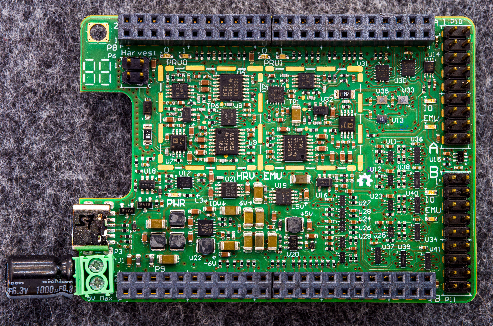
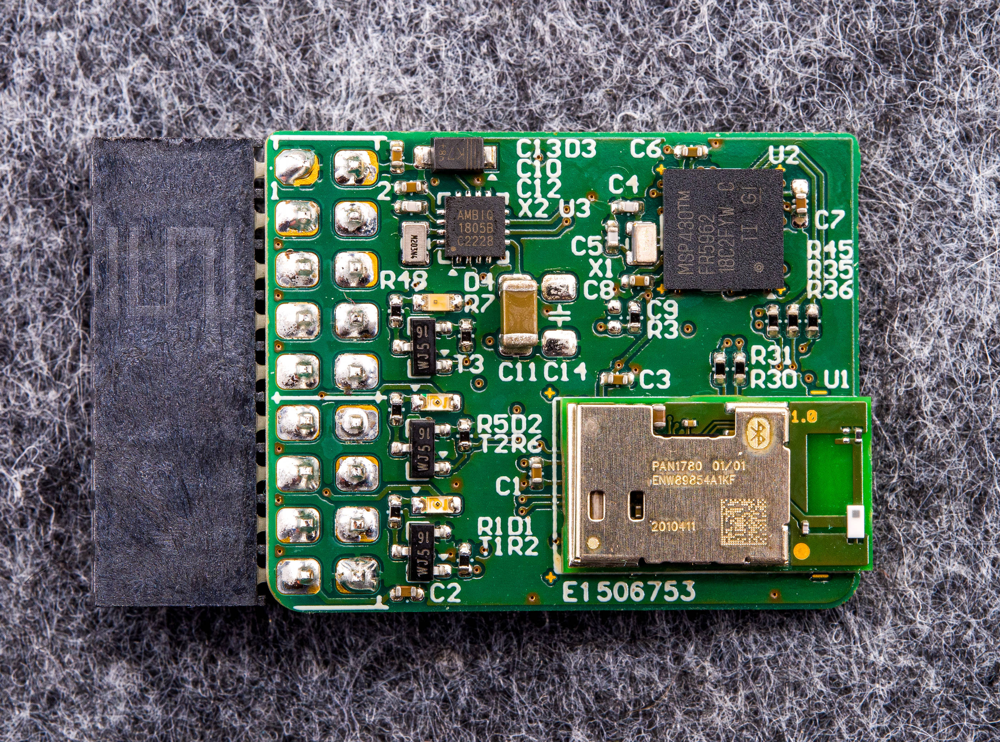

# Hardware

## Overview

Shepherd is a HW/SW solution and this section describes the key interfaces of the shepherd hardware that are relevant to users.

Each shepherd observer consists of five key components:

- The BeagleBone is a Single Board Computer, handling synchronization, data storage and hardware control
- The shepherd cape contains the harvester- and emulator-circuitry and all other fixed hardware parts
- an optional harvesting adapter can be used to interface a harvesting transducer (e.g. solar panel) to the harvesting-port on the cape
- The target pcb connects a sensor node (e.g. a microcontroller with radio) to the emulator-circuit

## The Cape

This custom PCB contains the analog frontend for harvesting & emulation operations.
The included components and features are:

- the emulator and harvester consist of a purpose-fully chosen combination of low-noise and high-speed DACs, ADCs and Instrumentation-Amplifiers

  - both circuits can handle 0 - 5 V with up to 50 mA current
  - LSB is ~ 200 nA and ~ 20 uV for voltage- and current-measurements

- two target-ports for the emulator, user choice
- two parallel power rails available for the targets (one with current measurement, switchable)
- one default target with a nrf52-module (see below)
- 9 GPIO-Channels between target and system (fully monitored), switchable direction on some channels
- 4 programming-lines to each target for JTAG, SWD or SBW
- level translated gpio is designed to prevent the transfer of energy. it is also possible to completely disconnect the target
- watchdog to recover from hangups during unsupervised operation
- screw-in power-socket or type-c connector
- eeprom to store calibration and cape-config

### References

- [/hardware-directory](https://github.com/orgua/shepherd/tree/main/hardware): contains cape, housing and additional design-files

## Harvesting Port

The harvesting port connects to any type of harvester, e.g., a solar panel or piezo-electric element to the shepherd hardware.
Some transducers need some external circuitry to work properly or for protection.
By keeping this part of the hardware separate from the main shepherd cape, we allow to easily connect various types of harvesters, without having to change the complex and expensive main cape.

:::{table} Header P6 pinout

| Pin | Description                                |
|-----|--------------------------------------------|
| 1   | Ground                                     |
| 2   | Voltage sensing input of harvest-circuitry |
| 3   | (optional) custom voltage from spare DAC   |
| 4   | Current sinking input of harvest-circuitry |
:::

## Harvesting Sources

Examples of tested and deployed energy harvesting sources.

### Solar

- Name: Anysolar - IXOLAR - SM141K06L
- Source: Light
- Operation: 4.15 VDC open, 184 mW Max, 3.35 V Pmpp, 58.6 mA Short
- Price: 4.80 € 1x, 3.47 € 100x
- Link: <https://www.digikey.de/product-detail/de/anysolar-ltd/SM141K06L/SM141K06L-ND/9990462>

### Piezo

- Name: Mide - S128-J1FR-1808YB
- Source: Mechanical Vibration
- Operation: 23.2 VDC, 16 mW
- Price: 64,77 € per Module
- Link: <https://www.mouser.de/ProductDetail/Mide/S128-J1FR-1808YB?qs=%2Fha2pyFadugcWv6TUOmJo5PvQenH8AtGZXSLNQdw9t1p66yQjFtz4w==>

This specific transducer needs an adapter with

- full bridge rectifier for the transducer (with low voltage drop)
- resistive voltage divider for max 5V v_sense (MOhm-Range)

## Target Port

Shepherd provides two identical generic interface-ports to connect any type of cyber-physical system. These can be supplied by emulated energy traces, while tracing its state via GPIO and UART output.

The target pcb connects to the shepherd cape via the dedicated headers P10 & P11 on the right side of the board.

:::{table} Header P10 / P11 pinout

| Pin | Description (Rx/TX always with reference to Observer)              |
|-----|--------------------------------------------------------------------|
| 1   | Ground                                                             |
| 2   | Emulator-Output V_Target                                           |
| 3   | GPIO0, RX & TX (Group1)                                            |
| 4   | GPIO1, RX & TX (Group1)                                            |
| 5   | GPIO2, RX & TX (Group1)                                            |
| 6   | GPIO3, RX & TX (Group1)                                            |
| 7   | GPIO4, always RX                                                   |
| 8   | GPIO5, always RX                                                   |
| 9   | GPIO6, always RX                                                   |
| 10  | GPIO7, always RX, also UART-RX to BBone UART1                      |
| 11  | GPIO8, RX & TX (Group2), also UART-TX to BBone UART1               |
| 12  | BAT OK, always TX, generated by PRU on BBone                       |
| 13  | Program1-CLK - Clock for remote programming (SWD, SBW) or JTAG-TCK |
| 14  | Program1-IO - Data for remote programming (SWD, SBW) or JTAG-TDI   |
| 15  | Program2-CLK - Clock for remote programming (SWD, SBW) or JTAG-TDO |
| 16  | Program2-IO - Data for remote programming (SWD, SBW) or JTAG-TMS   |
| 17  | +3V3, use for any additional infrastructure circuitry              |
| 18  | Ground                                                             |
:::

Notes:

- GPIO is always voltage translated and the direction is switchable in groups when noted in table.
- Pin 17 provides regulated 3.3V to supply any additional circuitry independent of the energy-tracing. This could be used to power, for example, a mosfet controlled debugging LED.
- Pins 10 and 11 expose the level-translated signals to UART1 on BeagleBone. They can be used to trace UART messages from the target sensor node.
- Pins 3 to 11 are (level-translated) connected to the low-latency GPIOs that are sampled by shepherd software for GPIO tracing.
- Pin 12 is tied to the virtual power source model and signals a power-good.
- Pins 13 to 16 (level-translated) are used to program/debug a connected sensor node with SWD, SBW or JTAG. This enables support for a wide range of microcontrollers.
- The header is symmetrical and therefore basically safe to reverse - so errors should not result in broken hardware.

## nRF-Target

This is shepherds current main target, hosting a nRF52 and MSP430, similar to the [Riotee](https://www.riotee.nessie-circuits.de) platform. Unfortunately the Riotee-SDK is not completely compatible for now, as the target is missing the hysteresis-function for the power-good-signal, which requires two pins.

The components and features are:

- MCU1: nRF52840
- MCU2: MSP430FR5962, 16 MHz, 128 kB FRAM, 8 kB SRAM, 68 IO, 12 bit DAC
- shared GPIO, Chip2Chip / SPI, LEDs, I2C RTC
- over-voltage protection for V_LV (max 3.9V)
- two debug LEDs with separate supply
- one self-powered LED to "burn" energy
- io pins not interfering with RF (nRF PS v1.6 page 578)
- LEDs / UART similar to Riotee
- LEDs have minimal impact on pwr-budget
- nRF uses low voltage mode (PSv1.1 page 61)
- 3rd possible way for reset (external), beside JTAG and pwr-cycle

### References

- [shepherd-targets](https://github.com/orgua/shepherd-targets): contains hardware and software sources for supported targets
