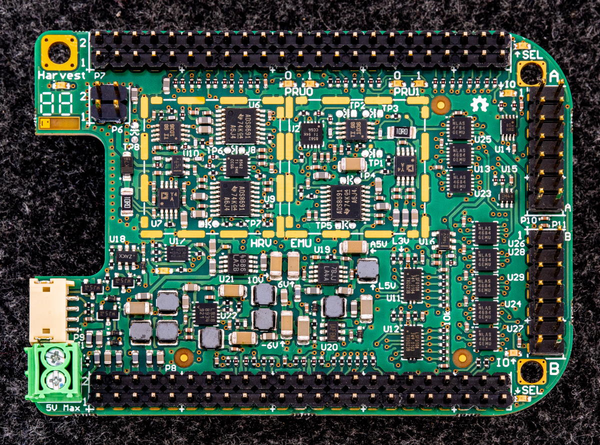

Hardware
========

Shepherd is a HW/SW solution and this section describes the key interfaces of the shepherd HW that are relevant to users.

Each shepherd node consists of 5 key components:

* The BeagleBone is a Single Board Computer, handling synchronization, data storage and hardware control
* The shepherd cape contains the harvester- and emulator-circuitry and all other fixed hardware parts
* The harvesting capelet connects a harvesting transducer (e.g. solar panel) to the input of the harvest-circuit on the shepherd cape
* The target capelet connects a sensor node (e.g. a microcontroller with radio) to the emulator-circuit

Harvesting capelet
------------------

The harvesting capelet connects any type of harvester, e.g., a solar panel or piezo-electric element to the shepherd hardware.
By keeping this part of the hardware separate from the main shepherd cape, we allow to easily connect various types of harvesters, without having to change the complex and expensive main cape.

The harvesting capelet connects to the shepherd cape via three headers.
Two headers connect directly on top the left half of the pins of the P8 and P9 headers on the BeagleBone.
The third header is the custom, 4-pin (2x2) connection P6 between the capelet and the cape in the upper left part of the PCB.

There are two reference harvesting capelets, one for solar harvesting (hardware/capelets/solar) and one for kinetic harvesting (hardware/capelets/kinetic).

.. table:: Header P6 pinout

    ========== =========================================
    Pin number Description
    ========== =========================================
    1          (optional) custom voltage from spare DAC
    2          Ground
    3          Current sinking input of harvest-circuitry
    4          Voltage sensing input of harvest-circuitry
    ========== =========================================

Target capelet
--------------

Shepherd provides two identical generic interfaces to connect any type of sensor node that can be supplied by emulated energy traces, while tracing its state with GPIO and UART.

The target capelet connects to the shepherd cape via the dedicated headers P10 & P11 on the right side of the board.

.. table:: Header P10 / P11 pinout

    ========== ====================================================================================
    Pin number Description (Rx/TX always with reference to BBone)
    ========== ====================================================================================
    1          Ground
    2          Emulator-Output V_Target
    3          GPIO0, RX & TX (Group1), voltage translated digital signal from target to BeagleBone for tracing
    4          GPIO1, RX & TX (Group1)
    5          GPIO2, RX & TX (Group1)
    6          GPIO3, RX & TX (Group1)
    7          GPIO4, always RX
    8          GPIO5, always RX
    9          GPIO6, always RX
    10         GPIO7, always RX, also UART RX to BeagleBone UART1
    11         GPIO8, RX & TX (Group2), also UART TX to BeagleBone UART1
    12         BAT OK, always TX, generated by PRU on Beaglebone
    13         Prog1-CLK - Clock line for remote programming (SWD, SBW) or JTAG-TCK
    14         Prog1-IO - Data line for remote programming (SWD, SBW) or JTAG-TDI
    15         Prog2-CLK - Clock line for remote programming (SWD, SBW) or JTAG-TDO
    16         Prog2-IO - Data line for remote programming (SWD, SBW) or JTAG-TMS
    17         +3V3, use for any additional infrastructure circuitry
    18         Ground
    ========== ====================================================================================

Pin 17 provides regulated 3.3V to supply any additional circuitry independent of the actual harvesting power supply.
This could be used to power, for example, a mosfet controlled debugging LED that should not interfere with the energy emulation/measurement.
Pins 10 and 11 expose the level-translated signals to UART1 on BeagleBone. They can be used to trace UART messages from the target sensor node.
Pins 3 to 11 are (level-translated) connected to the low-latency GPIOs that are sampled by shepherd software for GPIO tracing.
Pin 12 is tied to the virtual power source and signals a power-good.
Pins 13 to 16 (level-translated) are used to program/debug a connected sensor node with SWD, SBW or JTAG. This enables support for a wide range of microcontrollers.
The header is symmetrical and therefore basically safe to reverse - so errors should not result in broken hardware.

.. figure:: pics/pcb_nRF_Target_22_soldered.jpg
   :name: fig:target_soldered
   :width: 100.0%
   :alt: fully assembled nRF52 target capelet
