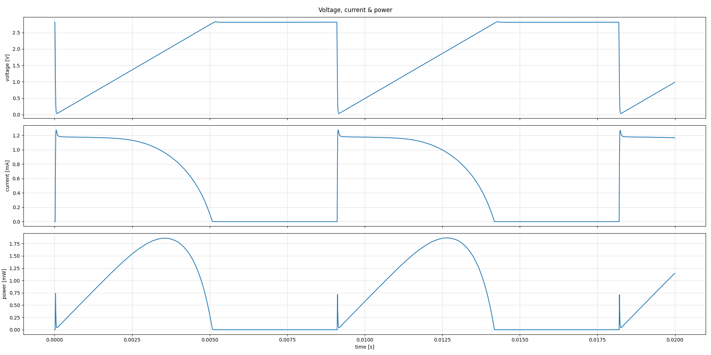
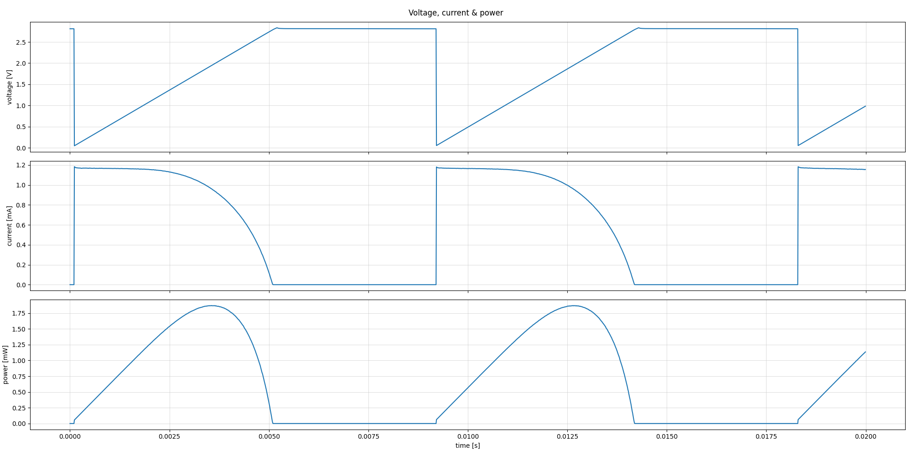
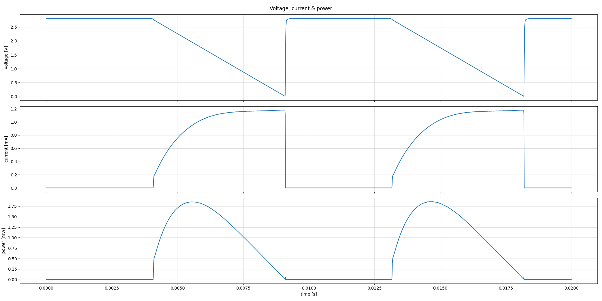
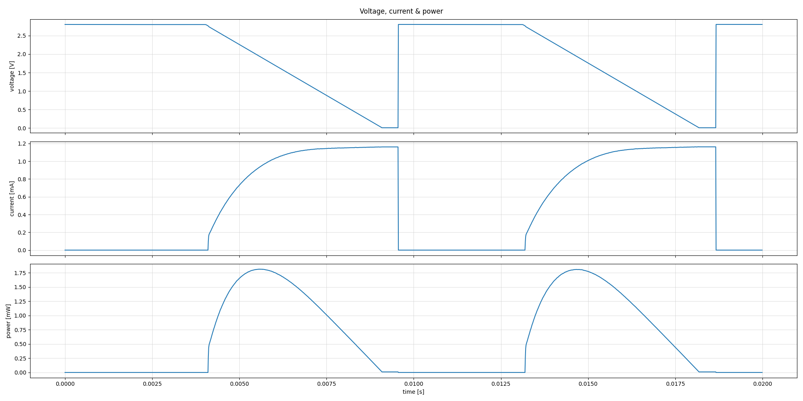

# Virtual Harvester

:::{note}
TODO: WORK IN PROGRESS
:::

## IVSurface - Transition-Cutout

The analog frontend needs a bit more than a cycle to handle large 5 V transitions.
Solar cells add extra capacitance to the frontend and make the transition slower.

The virtual harvester can cutout these transition periods to avoid recording unwanted capacitive effects.

Using the `cutout_cycles` and `enable_automatic_cutout` parameters is mostly meant to avoid post-processing before using the traces for emulation.
To avoid interfering with the window_size-calculations, this cutout happens at the beginning of the IVCurve-window and will influence V_OC or I_SC values (depending on `rising` parameter).

Automatic mode works by

- gets activated during reset of voltage-ramp
- hold the previous adc-samples during that transition
- check if transition is complete to disable cutout
  (i.e. if rising of voltage stops for a falling ramp)
- compensation for noise via `cutout_cycles`-parameter acting as buffer
  (forgiving that number of cycles that can violate condition before ending the cutout)

### Example 1 - Solar with Rising Ramp

- after restarting the voltage ramp (jumping down to 0 V), the current is higher than it should
- this varies with the cell-type and illumination and hints at some capacitive load on the cell

Note that there is another unwanted effect that raises the Voltage slightly higher when the ramp crosses V_OC.
Due to the design of the harvesting-circuit the recorded voltage shouldn't rise higher than V_OC.

### Example 1 - Solar with Falling Ramp

- after restarting the voltage ramp (jumping up to 5 V), the voltage step is rounded off

Note that there is another unwanted effect when the falling voltage ramp crosses V_OC, the current stays lower than expected for the first samples.
