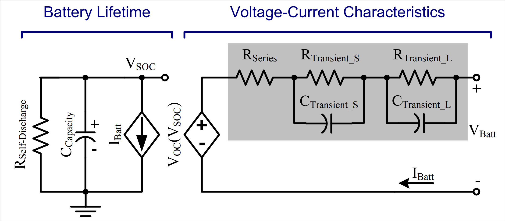
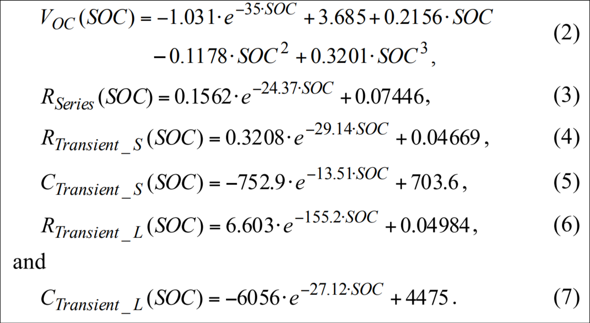
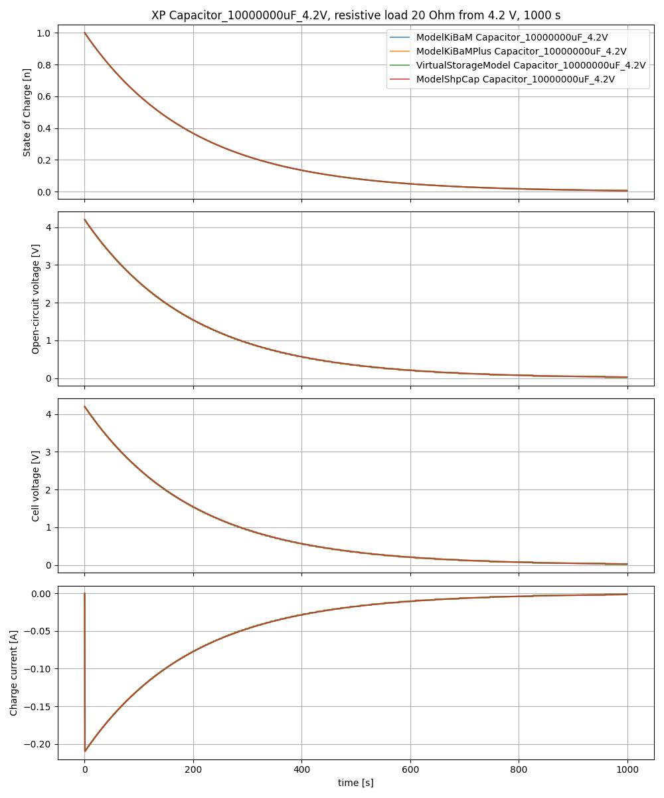
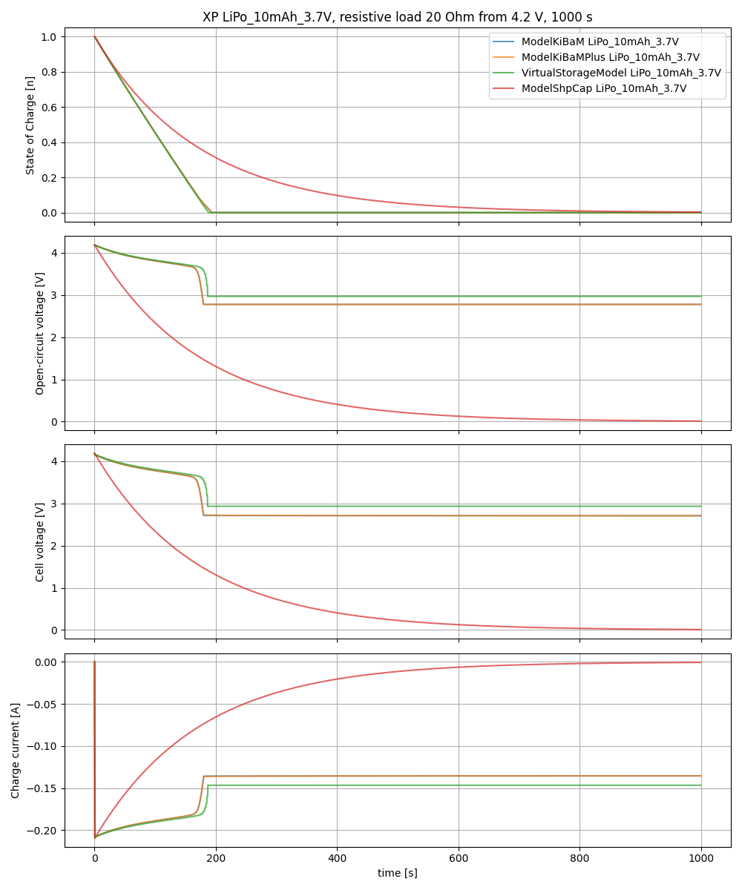
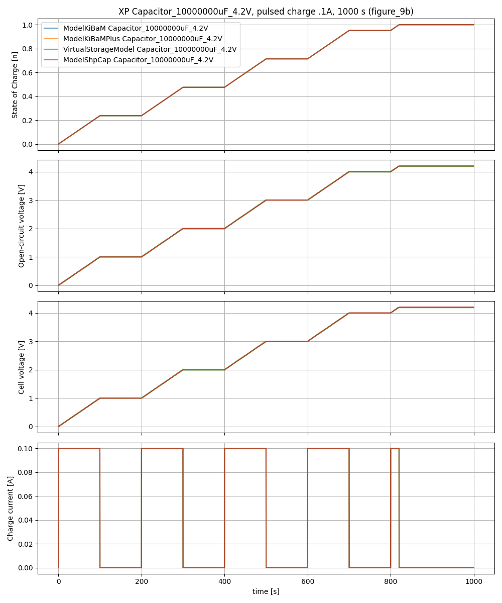
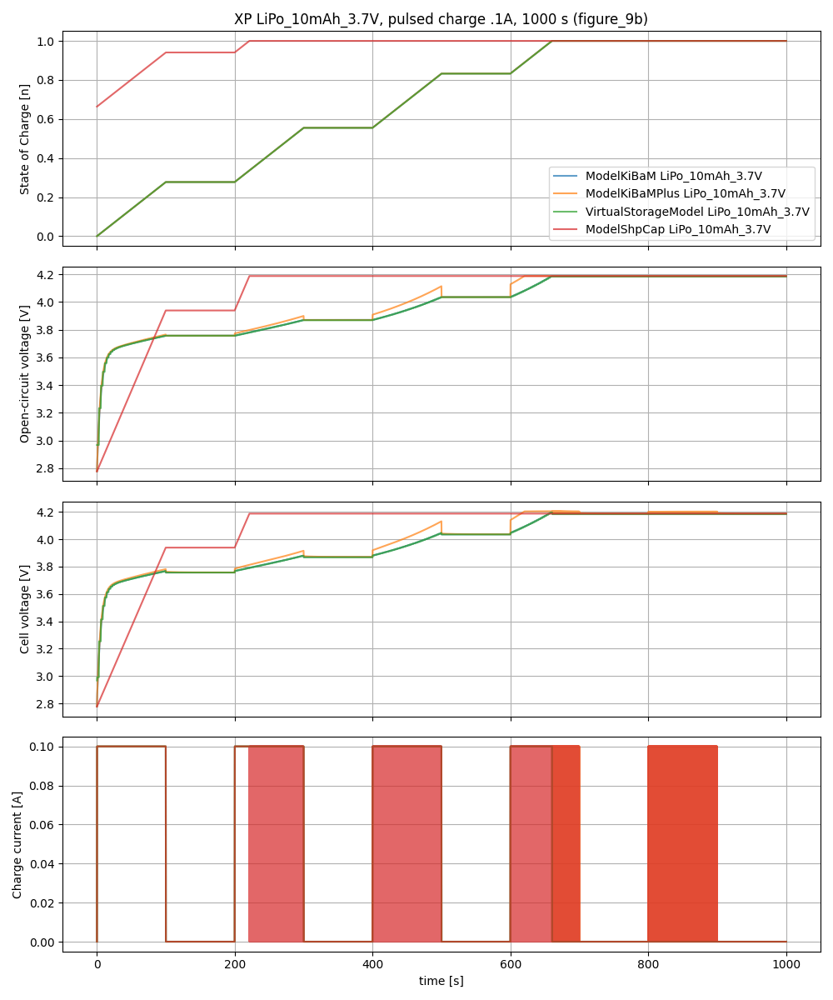
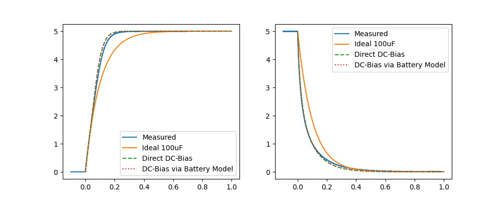

# Battery Model for Shepherd

## Basis

The model is based on the electrical model introduced in [_An Accurate Electrical Battery Model Capable of Predicting Runtime and I–V Performance_](https://rincon-mora.gatech.edu/publicat/jrnls/tec05_batt_mdl.pdf).

The circuit diagram of the electrical model is shown here:

The model uses:

- a capacitor (`C_capacity`) to model the `State of Charge` (SoC)
- a controlled voltage source to model the relation of SoC to open-circuit voltage
- a series resistor to model the current dependent voltage drop
- two RC elements to model transient voltage effects
- a resistor to model self-discharge (however, they later omit this, deeming it negligible)

The component values depend on the SoC through a set of equations:

These parameters model a specific battery and are provided by the authors.

## Kinetic Battery Model

The electrical model described above was used as a basis for the more complex hybrid model introduced in [_A Hybrid Battery Model Capable of Capturing Dynamic Circuit Characteristics and Nonlinear Capacity Effects_](https://digitalcommons.unl.edu/cgi/viewcontent.cgi?article=1210&context=electricalengineeringfacpub).

This model introduces the so called `rate capacity` effect which causes temporary changes in available capacity due to chemical effects that occur when a current is applied.
Since the corresponding formulas are rather complex, implementing them on the PRU is unfeasible.

However, the authors also parameterize their model and provide parameter values for both a Lithium-Polymer [(PL-383562)](https://www.batteryspace.com/prod-specs/pl383562.pdf) and a Lead-Acid [(LEOCH LP12-1.2AH)](https://www.leoch.com/pdf/reserve-power/agm-vrla/lp-general/LP12-1.2.pdf) battery.
A subset of these parameters can be used to configure the electrical model and extend the PRU implementation.
Shepherd keeps the whole parameter-set for a future-proof basis were the models can be extended when the computing platform changes.

Experiments showed that a broad range of configurations can be covered by this model:

- various capacitors (ideal, Tantal, MLCC inkluding Bias-Effect)
- lithium batteries (LiPo, LiOn, LiFe)
- lead acid

## Modifications

For a more generalized `virtual storage`, the following extensions were implemented for `KiBaM`:

- support the rate capacity effect and transients during charging (the original focuses only on discharge)
- self discharge was added as it is relevant for capacitors
- a 0 % SoC will let the voltage break down to 0
- future extension: include DC-bias effect, see section below

Due to processing-constraints the following modifications are made implementing the model on the PRU:

- the transient effects (e.g. the two RC elements, eq. 4 - 7) are omitted
- the equations (2, 3) for the open-circuit voltage and series resistor are replaced by lookup-tables (LuTs) which are generated from the model equations ahead of time
  - future plan: the quantized output voltage (due to the 128-entry LuT) may be smoothed via interpolation
- the capacitor is modeled discretely: `V_soc(t + dt) = V_soc(t) - (1 / C_capacity) * I_batt * dt`

## Comparison of Models

For qualifying the implementation a set of models was used to show differences in behavior:

- `KiBaM` is the model presented in the mentioned paper
- `KiBaMPlus` was extended to support the rate capacity effect and transients during charging (the original focuses only on discharge). It also added self discharge via a parallel leakage resistor
- `VirtualStorage` is the stripped down PRU-Version (see Modifications listed above)
- `ShpCap` is the (now) legacy implementation of the energy storage for shepherd

These models are capable of receiving and simulating the same parameter-sets

- `LiPo` battery with 10 mAh & 3.7 V nominal voltage
- ~~`Lead Acid` battery with 10 mAh & 12 V nominal voltage (6 cells)~~
- an ideal `Capacitor` with 10 F (to be comparable) and a rated Voltage of 4.2 V

For each a set of experiments was constructed to display the individual behavior

- a 20 Ohm resistive load
- pulsed charging
- ~~pulsed discharging~~ (similar to resistive load)
- ~~self discharge~~

The python scripts can be found in [shepherd_core/examples/simulations/vstorage.py](https://github.com/nes-lab/shepherd-tools/blob/dev/shepherd_core/examples/simulations/vstorage.py).

### Resistive Load

Putting a 20 Ohm load on the capacitor shows no surprises - all 4 models match in behavior:

Differences start to show when looking at the LiPo battery:

The KiBaM-based models both match in behavior and show the voltage curve of a typical lithium battery.
Even the stripped PRU-model (`VirtualStorage`) is close by, but lacks the rate capacity effect and is therefore missing the voltage drop.
The old shepherd capacitor (`ShpCap`) was not designed to mimic a battery and misbehaves completely.

### Pulsed Charging

Charging a capacitor with pulsed 100 mA is again covered by all 4 models:

Differences show again when looking at the LiPo:

While the old shepherd capacitor (`ShpCap`) was not designed to mimic a battery and can be ignored, the other models show interesting behaviors.
This time the simple KiBaM and the stripped PRU-Model (`VirtualStorage`) match, as both don't support transients during charging.
Looking at the voltages a non-linear trend shows, typical for lithium batteries.
In addition `KiBaMPlus` handles the rate capacity effect during charging, which shows as voltage increase while current is flowing.

## DC-Bias Effect

Some capacitors like MLCC-variants show a variable capacity, depending on the voltage they are used.
Small packages with high capacity are particularly susceptible to this DC-bias effect.
The datasheet of the JMK316ABJ107ML a 100 uF X5R MLCC with a rated voltage of 6.3 V show a capacity decrease of 80 % when run at the rated voltage.

In comparison to an ideal capacitor the charge- and discharge-curves differ substantially.
We were able to verify the datasheet for that specific capacitor by measuring both curves and plotting the datasheet data next to it (`direct`).
As an experiment the `VirtualStorage` PRU-Model (called `BatteryModel` in plot) was adapted to contain this effect in the SoC-LuT.

:::{note}
TODO: WORK IN PROGRESS
The DC-bias effect will be included in the near future. More measurements and research are needed to offer a parameter-set.
:::

## References

- parameters for the config can be found as [data-model in the core-tool](https://github.com/nes-lab/shepherd-tools/tree/main/shepherd_core/shepherd_core/data_models/content)
  - a fixture creation script and the fixtures itself are in the same directory
- the virtual storage for the testbed is implemented in c and [part of the PRU-firmware](https://github.com/nes-lab/shepherd/tree/main/software/firmware/pru0-shepherd-fw)
- the 1-to-1 simulation-models are part of the [python vSource-implementation](https://github.com/nes-lab/shepherd-tools/tree/main/shepherd_core/shepherd_core/vsource)
- simulation-experiments are kept in the [examples-directory of the core-tool](https://github.com/nes-lab/shepherd-tools/tree/main/shepherd_core/examples/simulation)
- performance analysis between python-models, c-code and actual are [documented here](https://github.com/nes-lab/shepherd/blob/main/software/debug_compare_vsources/README.md)
