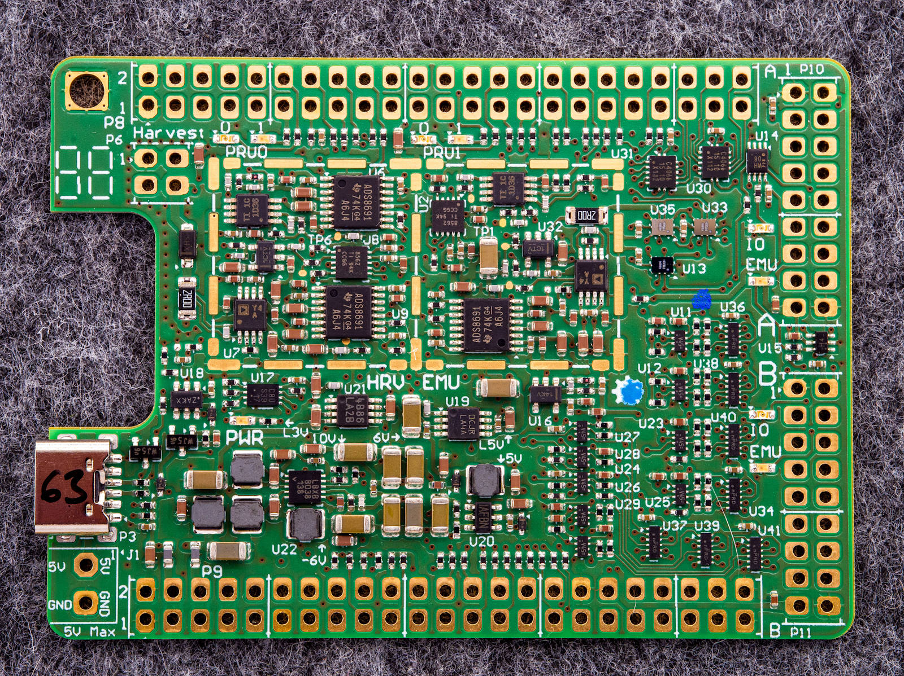
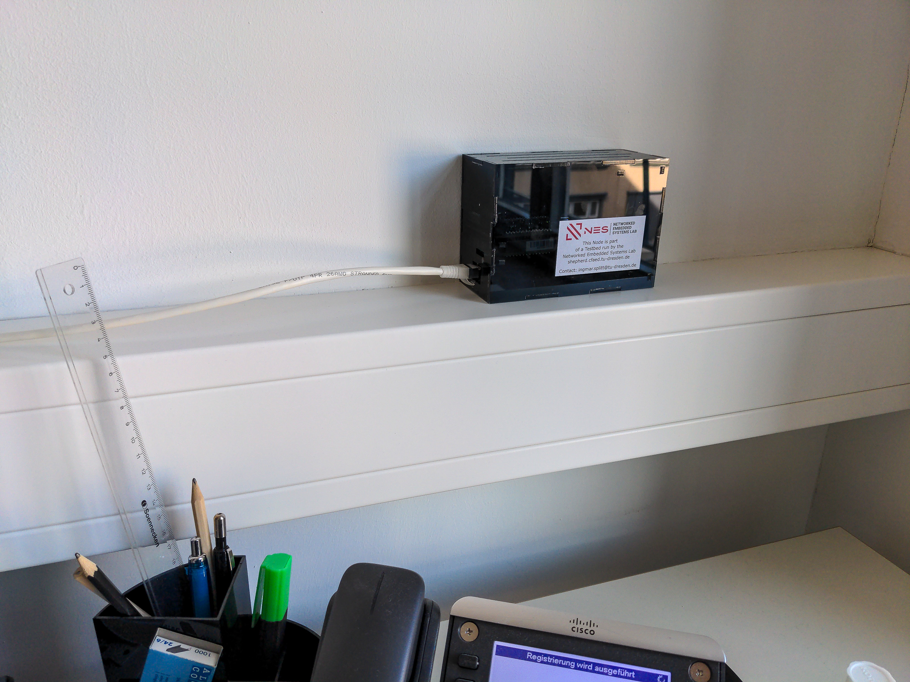
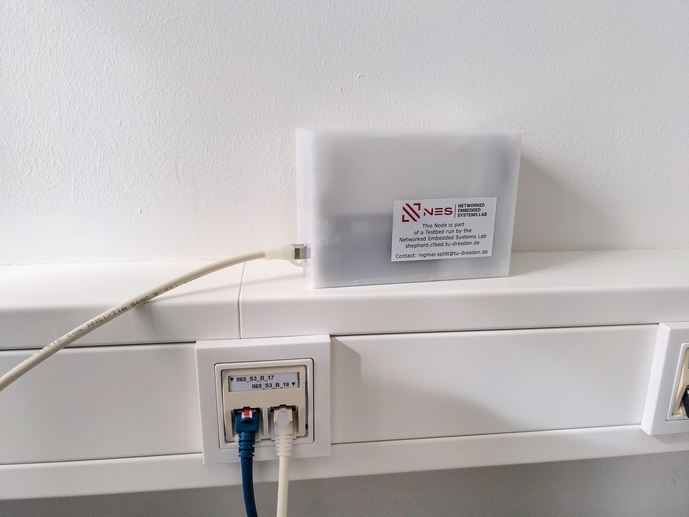

# Shepherd specific Hardware

## Overview

Hardware-Subdirectories contain the necessary design-files to manufacture a shepherd observer node.

- `_deprecated`: design files for hardware that still floats around in the lab
- `cape_v#.#`: most recent version of shepherd cape for the BBone
- `case_lasercut`: deployment version for testbed
- `power_in`: low noise voltage regulator with < 17 V Input for TP-Link POE-Adapters that fail to produce 5V on newer Cisco Switches
- Targets are in dedicated [target-lib](https://github.com/orgua/shepherd-targets/tree/main/hardware)

## Photos

### Cape v2.4

More pictures are stored for QA in [planning-repo](https://github.com/orgua/shepherd_v2_planning/tree/main/doc_testbed/photos_PCBs).

### Observers

Assembled in August 2023 for the deployment at TU Dresden. These nodes contain:

- TP-Link POE Splitter
- BeagleBone Green
- Shepherd Cape v2.4
- nRF FRAM Target v1.0
- Power-in-PCB
- Laser-cut case

