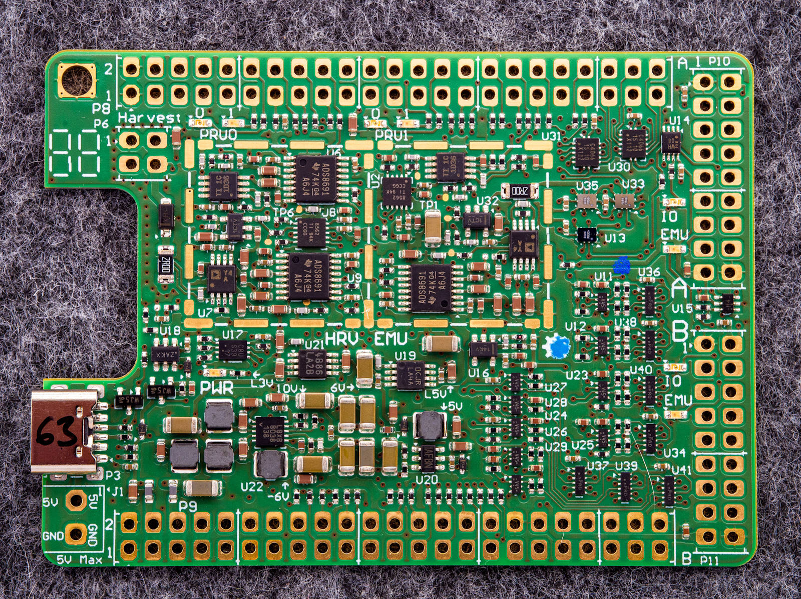

# Shepherd specific Hardware

## Overview

- `_deprecated`: design files for hardware that still floats around in the lab
- `cape`: most recent version of shepherd cape for the BBone
- `case_lasercut`: deployment version for testbed
- `power_in`: low noise voltage regulator with < 17 V Input for TP-Link POE-Adapters that fail to produce 5V
- Targets are in dedicated [target-lib](https://github.com/orgua/shepherd-targets/tree/main/hardware)

## Photos

more pictures are in [planning-repo](https://github.com/orgua/shepherd_v2_planning/tree/main/doc_testbed/photos_PCBs)
