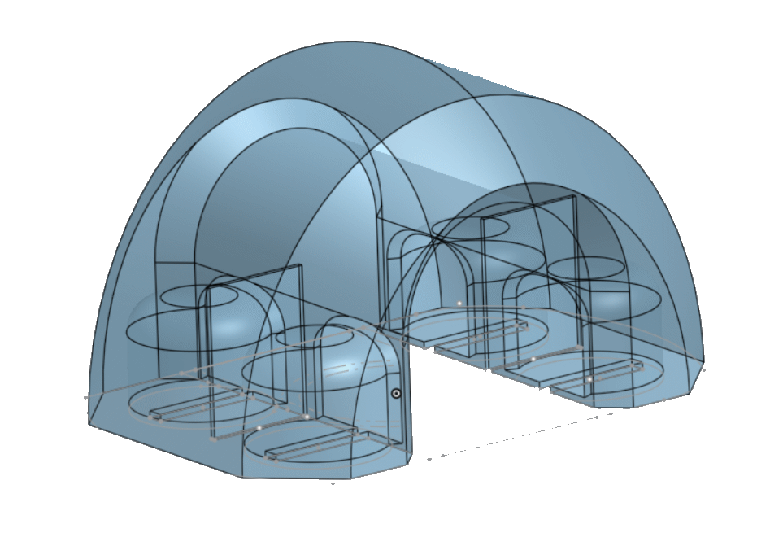

# 3D-Printed Cable Clip

## Features

- holds cable with up to 6.5 mm diameter cable
- can take 1 to 4 magnets (4 mm diameter, 2 mm height)
- magnets can be pushed inside from the side of the cable-channel
- < 1 g PLA filament
- can be printed without support

[Designed in onshape](https://cad.onshape.com/documents/66bf84de817494616f210bb4/w/bc75bb6701e47c344748dd48/e/8d123086b6a33f87c60c09e2)
