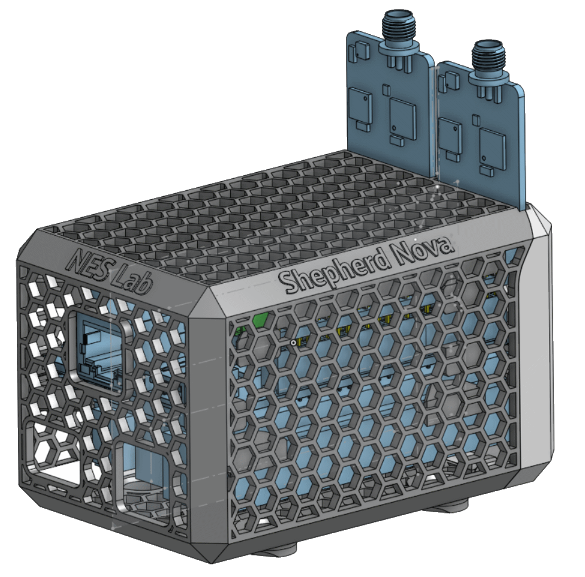

# 3D Printed Case for the Observer Nodes

## Features

- high airflow case for Beaglebone, Cape & POE-Adapter
- internal rails for the PCBs
- feet with space for cylindrical magnets (8x3 mm, Dxh) for over head installation
- two parts that clip together
- openings for all emulator related ports
- 36 g PLA filament
- can be printed without support (flip end-face to print-plate)

[Designed in onshape](https://cad.onshape.com/documents/cdcbe7f9671a626c8653eaf6/w/935ef12e9d106129efaf4b0b/e/58438ca06a4c5f672a67230e)

## Pending Improvements

- need for more or longer initial rails
- better BBB rail - the stack slides out easily - so also cover the solder joints of the header
- power cable in front should have more space or dedicated hole
- case could be smaller: back 1 mm, top 1 mm, sides 1 mm
- make rail-parts go half way or fully into mesh
- refactor, as the project got messy at the end
