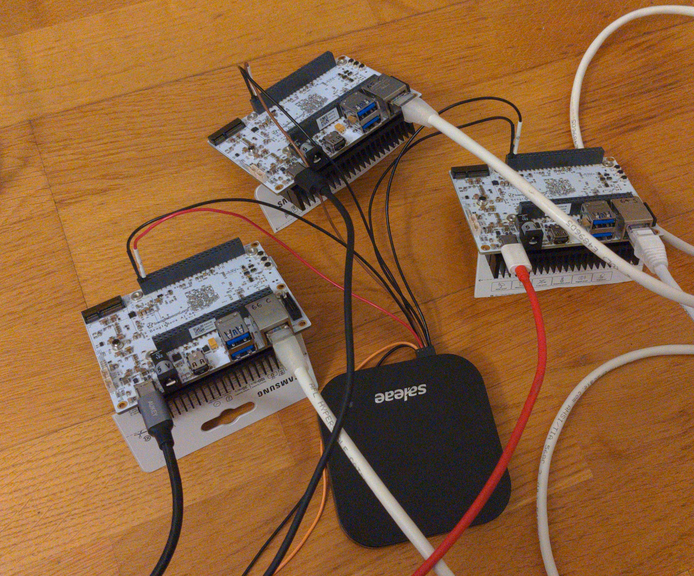
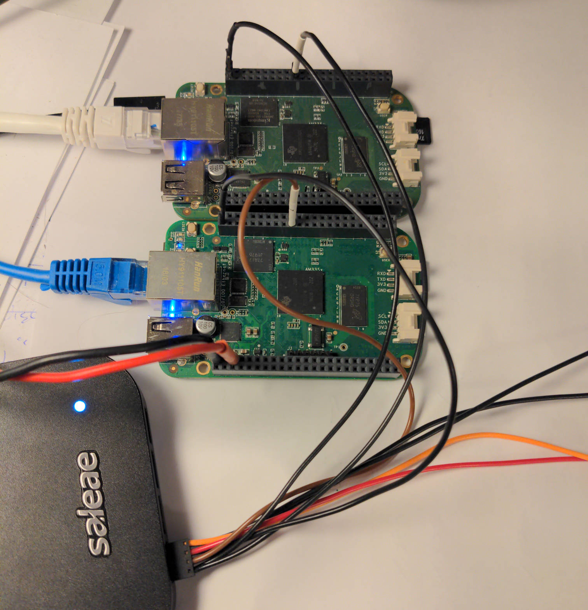

# Hardware Setup

There are three steps for getting the hardware ready:

- get all nodes on the same network
  - Try to model the future network
- route power to each one
  - special reqs. are noted below
  - POE-Adapters are always a good idea
- get the logic analyzer connected to the gpio-trigger-output
  - connecting the ptp server to pin 0 is recommended, as it might show a difference in behavior
  - don't forget to also connect ground

Small introduction into Saleae logic analyzer

- channel-numbers are printed on the back-side
- the removable connector-leads are color-coded and also have the channel-number printed on the individual end
- all ground-cables are black & without a channel-number printing

## Raspberry Pi CM4

- power via barrel connector can be 7 - 27 V and defaults to 12 V
- current draw is typically < 150 mA @ 12 V, can increase under load, but is < 500 mA
- signal-pin is the uppermost right on the main connector
- ground reference is right below signal

## BBone AI64

- power via USB Type C is fine
- be sure to give the heatsink some air - the system can crash from heat
- signal-pin is the second from left on the lower row on P8
- ground reference is left from signal, in the lower left corner

## BBone Black

Small introduction into beaglebone

- orientation: ICs / CPU visible, ETH-Connector facing left so the white font (silkscreen) on PCB is readable
- there are two large connectors P8 on top, P9 on bottom. each has 46 pins, with pin 1 in the lower left corner - compare with silkscreen
- P8 is our main-connector for the test. Pin 1 & 2 (left-most) are ground / GND
- NOTE: there are (small) white markers on the PCB that indicate start of a decade

Connect logic analyzer to each sheep

- GND goes to P8-01 or P8-02
- Channel wire goes to P8-19 for the kernel-output
- for debug another channel can be hooked up to P8-28 (pru-output)

