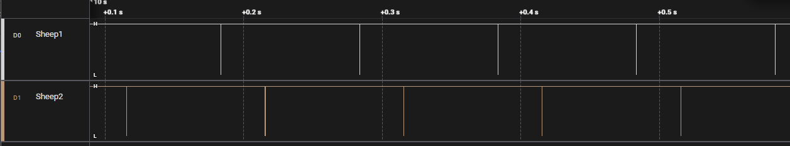

# Measurement

## Preparation

- set up hardware according to the [tutorial](Readme_B_setup_hardware.md)
- check that ptp is working
  - option 1: via logic analyzer (see subchapter below)
  - option 2: via ssh-connection (commands below)
- PTP should be given >= 5 minutes to stabilize
- room-temperature should be stable, as clock-crystals react to that

**Note for RPi CM4**

Changing the governor does not always work during boot, please check. At least the ptp-server is mostly stuck on `ondemand`.

```Shell
# check
cpufreq-info
# reset
sudo cpufreq-set --governor performance
```

### Quick-HowTo for Sync-Services

Current state of PTP can be checked on the nodes with

```Shell
sudo journalctl -u ptp4l@eth0.service -b -f
sudo journalctl -u phc2sys@eth0.service -b -f
```

Fixing time-sync problems can be solved be restarting the services and shepherd-kernel-module

```shell
# note: if ptp is restarted, phc must also be restarted
sudo systemctl restart ptp4l@eth0
sudo systemctl restart phc2sys@eth0
```

Screenshots of correctly running [ptp](media/ptp_running_fine.png) and [phc2sys](media/phc2sys_running_fine.png) services are show behind the link. Both tools can misbehave when other ptp-hosts are present. Frequency adjustment value usually jumps to max in that case (+-100 us).

### Quick-HowTo for Logic 2 Software

- config under `Device Settings` (device-shaped symbol in top left corner of plot)
  - select connected channels -> usually `0 to 2` (Digital, NOT Analog)
  - select highest samplerate -> `500 MS/s`
  - select highest voltage-levels -> `3.3+ Volts`
  - set `Timer` to record for `100 s` (and stop automatically after that)


- a failed sync looks like that:



- a successful sync shows minimal delay between the rising edges of each node, seen here with 92 ns as largest distance


**Don't forget** to save the capture after each measurement with a meaningful name, i.e. `01_baseline.sal`!

### Quick-HowTo for IPerf3

IPerf3 can be used to generate network traffic.

```Shell
sudo apt install iperf3

# mockup server: device receiving data
iperf3 -s

# ptp-clients send, here 100Mbit to server-IP for 10 s
iperf3 -b 100M -c 10.0.0.200
```

The server can only receive data from one client at the same time. Therefor the two ptp-clients should be used in alternating pattern. It's best to start the recording first, then begin with traffic and alternate for ~ 50 - 70 s. The recording should show ~ 20 s of ptp getting back to normal at the end.

## Collecting the Data with Logic 2 Software

It's recommended to separate different campaigns and hardware-setups by subdirectories. A small textual description can help for later analysis. Notes of oddities and reported ptp path delays add valuable context.

The following measurements are recommended:

- 01 - baseline (stable, undisturbed network)
- 02 - ptp-clients send data to external host with 100 Mbit/s
- 03 - ptp-clients send data with 200 Mbit/s
- 04 - ptp-clients send data with 400 Mbit/s
- 05 - ptp-clients send data with 800 Mbit/s
- 06 - ptp-clients receive data from external host with 100 Mbit/s
- 07 - ptp-clients receive data with 200 Mbit/s
- 08 - two external hosts send at max rate

Each running for 100 s.
