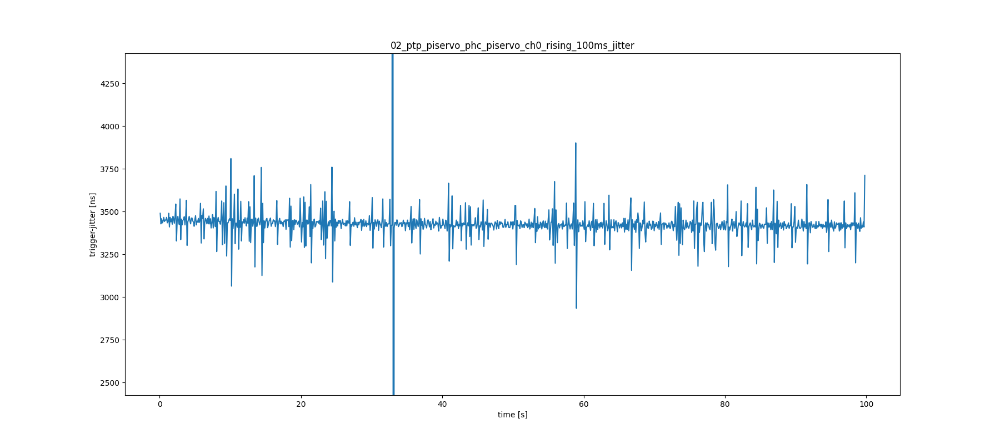
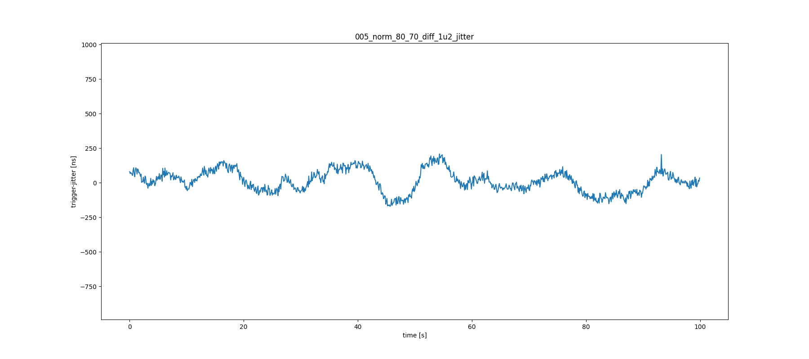

# Prepare Data for the Tool

- Logic 2 Software -> File -> Export Data
- select channels: 1-3 ???
- Time Range: All Time
- Format: CSV
- DON'T use ISO8601 timestamps
- Export and rename file to meaningful description

# Analysis

Setup: 

- same cisco switch
- same software configuration
- data recorded with a logic pro 16 @ 500 MHz

## GPIO - Jitter 

How accurate is the 100 ms trigger on different platforms? Lets visualize the jitter of one node.

**BBone Black**

**BBone AI64**

**Raspberry Pi CM4**

Some context and final words:
- BBB takes ~ 300 ns to get kernel time. performance looks fine considering the age of the platform
- BBAI takes ~ 40 ns to get kernel time. the random spikes are still unexplained. It could be caused by one of several register-write-locks. The SOC has several co-processors that share the same bus. 
- CM4 was overclocked to match BB-Ai, so it also takes ~ 40 ns to get kernel time. jitter looks best of these three systems

## Sync Performance

**BBone AI64**

**Raspberry Pi CM4**

